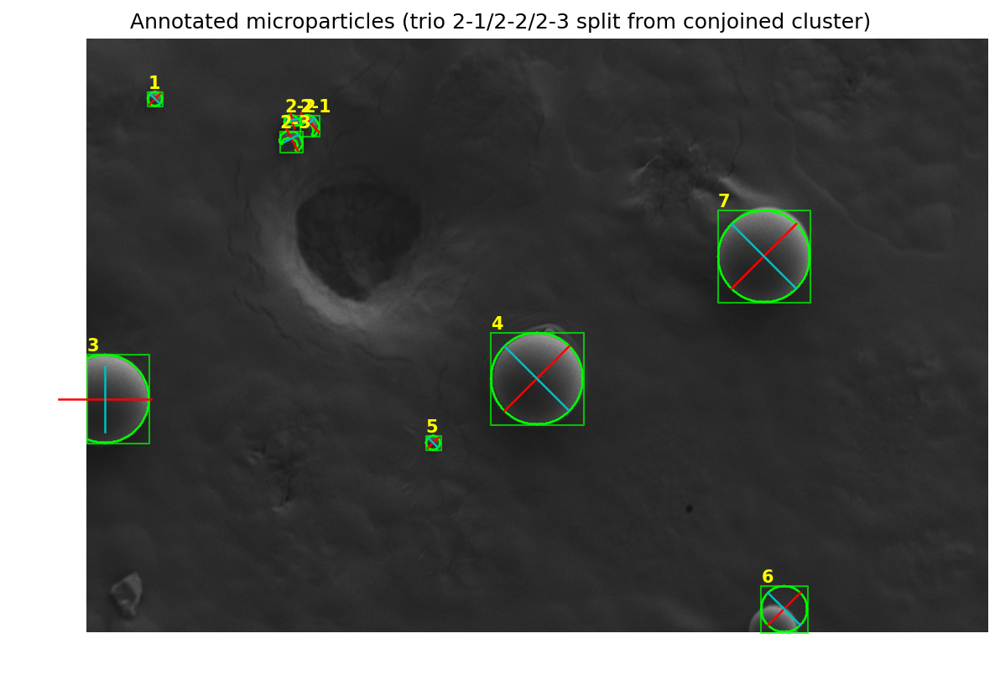

# AutoSphereAnalyzer

Automated measurement of spherical microparticles in SEM micrographs using **regionprops**-style metrics (Python via scikit-image; optional MATLAB script included).

The pipeline detects user-annotated spheres, splits touching clusters where needed, calibrates from an embedded scale bar, and exports per-particle images, Excel measurements, and summary plots.



## Features

- **Region properties**: area, perimeter, bounding box, centroid, major/minor axis lengths, orientation, eccentricity, solidity, extent, equivalent diameter, Feret diameter, intensity statistics, and derived circularity
- **Per-particle PNGs**: cropped view with bounding box and major/minor axes
- **Excel export**: `measurements`, `annotation_summary`, and `metadata` sheets
- **Metrics plots**: size distribution, axis scatter, area vs. diameter
- **Conjoined spheres**: watershed separation for touching clusters (e.g. a trio labeled as one annotation group)
- **Edge-truncated spheres**: bottom- or left-clipped particles handled with adjusted centering

## Requirements

- Python 3.10+
- Optional: MATLAB with Image Processing Toolbox (`analyze_microparticles.m`)

## Quick start

```bash
git clone https://github.com/ganttmeredith/AutoSphereAnalyzer.git
cd AutoSphereAnalyzer
python3 -m venv .venv
source .venv/bin/activate   # Windows: .venv\Scripts\activate
pip install -r requirements.txt
```

Place your SEM image as `input_image.png` in the project root (or pass a custom path). The image should include a **100 µm scale bar** in the metadata strip and seven annotated target regions configured in `analyze_microparticles.py` (`PARTICLE_WINDOWS`).

```bash
python analyze_microparticles.py
# or
python analyze_microparticles.py --image /path/to/micrograph.png --output-dir ./results
```

## Outputs

| File | Description |
|------|-------------|
| `output/segmentation_overview.png` | Full-field view with labels, boxes, and axes |
| `output/particle_metrics_visualization.png` | Summary charts |
| `output/particle_measurements.xlsx` | All metrics (µm and pixels) |
| `output/particles/particle_*.png` | Individual annotated crops |

## Configuring target spheres

Edit `PARTICLE_WINDOWS` in `analyze_microparticles.py` to match `(y0, y1, x0, x1)` search regions for each annotation ID. Set `COMBINED_ANNOTATIONS` for groups that contain multiple touching spheres (watershed split).

## MATLAB

```matlab
% Place micrograph as input_image.png, then:
analyze_microparticles
```

## Privacy note

Sample raw micrographs are **not** included in this repository. The README figure is a **de-identified analysis output** only.

Created by Orator
